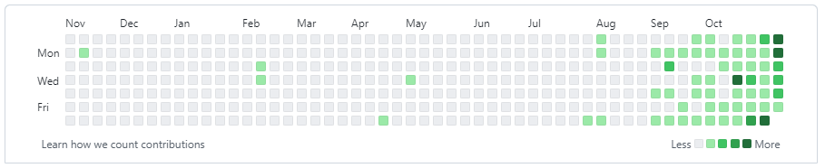
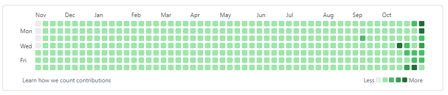

# GitHubに人工芝を生やせ！

  
  

ん？短時間でGitHubの見た目をきれいにしたい？  
じゃあたった15分で最強のGitHubプロフィールを人工芝で緑豊にする方法教えてやるよぉっ！！！

## 01. このリポジトリをクローンせよ

```shell
git clone https://github.com/osawa-koki/keep_it_green.ps1.git
```

## 02. Dockerをインストールせよ

<https://docs.docker.com/engine/install/>  

### DevContainerで開け

VSCodeの左下にある、「Remote Dev」タグから、リポジトリをDocker上で再現せよ。  
Windowsユーザならこの処理は不要だぞ。  

### 実行せよ

```shell
cd app
git init
./main.ps1

# 何日前からやる??? -> 365
# 一日の最低コミット数は??? -> 1
# 一日の最高コミット数は??? -> 10
# これでいい??? -> y
```

ちなみに、中身の処理は「AuthorDate」と「CommitterDate」を過去に遡って変更しているぞ。  

最後にGitHubへプッシュせよ。  

```shell
git remote add origin https://github.com/★ユーザ名★/★リポジトリ名★.git
git push -u origin main
```

もし、悟りを開いて削除したかったらこれだ！

```shell
# Gitリポジトリを削除
cd ../
rm -rf app/.git

# GitHub上でも削除してね♪

# Dockerコンテナ一覧を表示
docker ps -a
# Dockerコンテナを削除
docker rm <コンテナID>
```

## 03. 自分なりにカスタマイズしろ

初期設定だと人工芝の色が似通ってしまう。  
一応、最低値と最高値の間の乱数を生成して色付けをしているが、これではきれいではないかもしれない。  
そんな時には自分なりにスクリプトを書き換えろ。  

スクリプトは「./app/main.ps1」にあるぞ。  

スクリプトを実行しなおせば反映される！

以上だ!!  

## 参考文献
- [わずか5分で最強のzsh環境を構築したいか？😎](https://github.com/yamato0811/5min-zsh-env)
